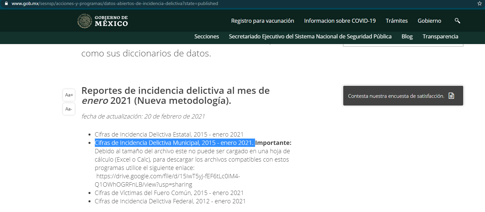

### SESNSP - Secretariado Ejecutivo del Sistema Nacional de Seguridad Pública

#### Source: https://www.gob.mx/sesnsp/acciones-y-programas/datos-abiertos-de-incidencia-delictiva?state=published
- Update GCP with that file:




#### Usage:
`bamboo-cli --folder . --entry crimes_pipeline`

#### Sample data:
```
┌─mun_id─┬─crime_subtype_id─┬─crime_modality_id─┬─value─┬─month_id─┐
│   1001 │            50101 │                 1 │     0 │   201501 │
│   1001 │            10101 │                 2 │    38 │   201501 │
│   1001 │            30101 │                 3 │     5 │   201501 │
│   1001 │            30201 │                 4 │     0 │   201501 │
│   1001 │            70101 │                 5 │    12 │   201501 │
└────────┴──────────────────┴───────────────────┴───────┴──────────┘
```
