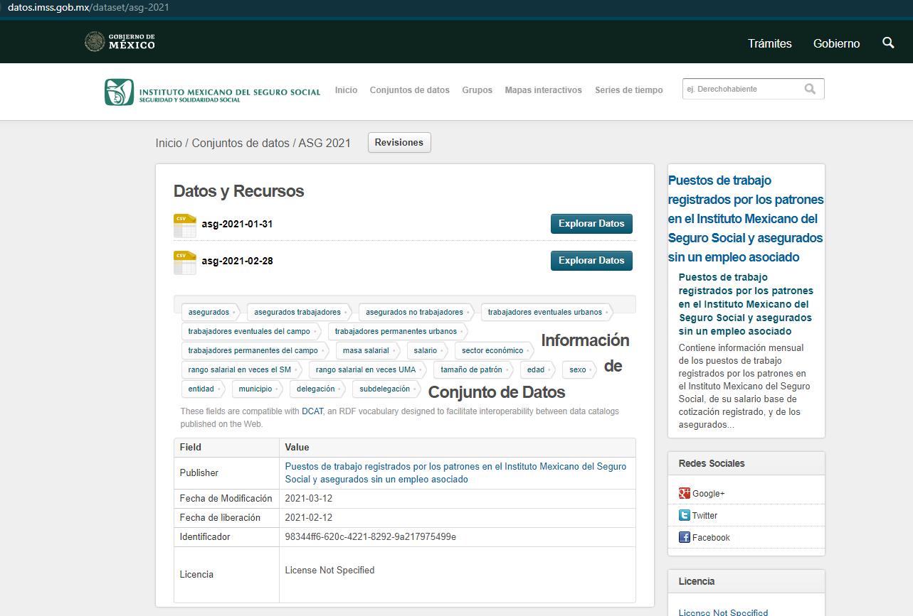

### IMSS - Instituto Mexicano del Seguro Social

#### Source: http://datos.imss.gob.mx/group/asegurados
- there are folders like ASG 2021 which lead you to the downloads: http://datos.imss.gob.mx/dataset/asg-2021
- Update GCP with those files:




#### Usage:
`bamboo-cli --folder . --entry imss_pipeline --year="2021" --month="01"`

#### Sample data:
```
┌─age_range─┬─mun_id─┬─salary_range─┬─level_4_id─┬─sex─┬─pattern_size─┬─uma_range─┬─asegurados─┬─non_workers─┬─ta─┬─teu─┬─tec─┬─tpu─┬─tpc─┬─masa_sal_ta─┬─count─┬─salary─┬─month_id─┐
│         1 │   1001 │            0 │          0 │   1 │            0 │         0 │        220 │         220 │  0 │   0 │   0 │   0 │   0 │           0 │     2 │      0 │   201901 │
│         1 │   1001 │            0 │          0 │   2 │            0 │         0 │        212 │         212 │  0 │   0 │   0 │   0 │   0 │           0 │     2 │      0 │   201901 │
│         1 │   1001 │            2 │       4101 │   1 │            3 │         2 │          5 │           0 │  5 │   4 │   0 │   1 │   0 │         646 │     2 │    323 │   201901 │
│         1 │   1001 │            2 │       4101 │   1 │            3 │         3 │          1 │           0 │  1 │   1 │   0 │   0 │   0 │         163 │     1 │    163 │   201901 │
│         1 │   1001 │            2 │       4102 │   1 │            3 │         2 │          1 │           0 │  1 │   1 │   0 │   0 │   0 │         130 │     1 │    130 │   201901 │
└───────────┴────────┴──────────────┴────────────┴─────┴──────────────┴───────────┴────────────┴─────────────┴────┴─────┴─────┴─────┴─────┴─────────────┴───────┴────────┴──────────┘
```
